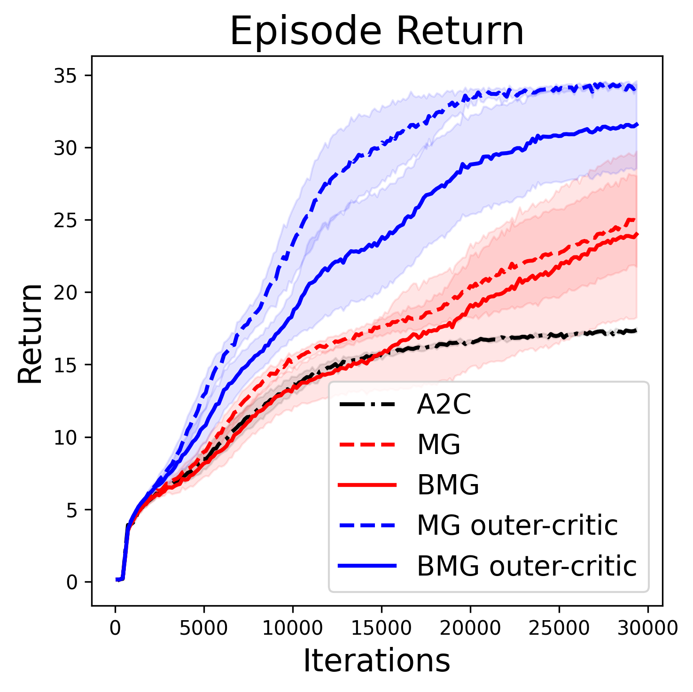

# Debiasing Meta-Gradient Reinforcement Learning by Learning the Outer Value Function

This repository contains the code from the paper [_Debiasing Meta-Gradient Reinforcement Learning by
Learning the Outer Value Function_](https://arxiv.org/abs/2211.10550) (Clément Bonnet, Laurence Midgley,
Alexandre Laterre) published at the [6th Workshop on Meta-Learning](https://meta-learn.github.io/2022/)
at NeurIPS 2022, New Orleans.

## Abstract
Meta-gradient Reinforcement Learning (RL) allows agents to self-tune their hyper-parameters in an online fashion during training.
In this paper, we identify a bias in the meta-gradient of current meta-gradient RL approaches.
This bias comes from using the critic that is trained using the meta-learned discount factor for the advantage estimation in the outer objective which requires a different discount factor.
Because the meta-learned discount factor is typically lower than the one used in the outer objective, the resulting bias can cause the meta-gradient to favor myopic policies.
We propose a simple solution to this issue: we eliminate this bias by using an alternative, *outer* value function in the estimation of the outer loss.
To obtain this outer value function we add a second head to the critic network and train it alongside the classic critic, using the outer loss discount factor.
On an illustrative toy problem, we show that the bias can cause catastrophic failure of current meta-gradient RL approaches, and show that our proposed solution fixes it.
We then apply our method to a more complex environment and demonstrate that fixing the meta-gradient bias can significantly improve performance.


## Experiments

We denote:
- A2C: Advantage Actor Critic
- MG: meta-gradient algorithm from [Xu et al., 2018]
- BMG: bootstrapped meta-gradients from [Flennerhag et al., 2022]
- MG outer-critic: the MG algorithm equipped with an outer-critic that estimates the outer value function used in the outer loss
- BMG outer-critic: the BMG algorithm similarly equipped with an outer-critic

### Discounting Chain
<p float="left" align="center">
  
  
</p>

### Snake
<p float="left" align="center">
  
  
</p>


## Reproducibility

We provide a `requirements.txt` file with all the tagged packages needed to reproduce the
experiments in the paper.
Here is a snippet of commands to set up a virtual environment and install these packages.
Alternatively, one can use a Conda environment or a similar solution.
```shell
python -m venv venv
source venv/bin/activate
pip install -U pip setuptools wheel
pip install -r requirements.txt
```

### Discounting Chain

The Discounting Chain environment is originally from [bsuite](https://github.com/deepmind/bsuite) but is imported from [Gymnax](https://github.com/RobertTLange/gymnax) in this paper to benefit from its JAX implementation.

To reproduce the experiments on the Discounting Chain environment, you can run the jupyter notebook `discounting_chain_train.ipynb`.
The other notebook `discounting_chain.ipynb` loads the data and plots the figures from the paper.

### Snake

The Snake environment is provided by [Jumanji](https://github.com/instadeepai/jumanji) in JAX.

To reproduce the experiments on the Snake environment, one can run the following commands.

- Advantage Actor Critic (A2C)
```shell
python snake_train.py -m agent=a2c training.seed=1,2,3,4,5,6,7,8,9,10
```

- Meta-Gradient (MG)
```shell
python snake_train.py -m agent=mgrl agent.outer_critic=false training.seed=1,2,3,4,5,6,7,8,9,10
python snake_train.py -m agent=mgrl agent.outer_critic=true training.seed=1,2,3,4,5,6,7,8,9,10
```

- Bootstrapped Meta-Gradient (BMG)
```shell
python snake_train.py -m agent=bootstrap agent.outer_critic=false training.seed=1,2,3,4,5,6,7,8,9,10
python snake_train.py -m agent=bootstrap agent.outer_critic=true training.seed=1,2,3,4,5,6,7,8,9,10
```

- appendix
```shell
python snake_train.py -m agent=a2c agent.outer_critic=false agent.normalize_advantage=false,true agent.normalize_outer_advantage=false training.seed=1
python snake_train.py -m agent=mgrl agent.outer_critic=false,true agent.normalize_advantage=false,true agent.normalize_outer_advantage=false,true training.seed=1
python snake_train.py -m agent=bootstrap agent.outer_critic=false,true agent.normalize_advantage=false,true agent.normalize_outer_advantage=false,true training.seed=1
```

Note that the default logger is `"terminal"`. If you want to save the data, a Neptune logger is implemented,
and you can enable it by replacing `"terminal"` with `"neptune"` in `snake_train.py`.

For the paper, the data from these runs was collected and uploaded in `snake/data/`.
The `snake.ipynb` notebook loads this data and make the plots from the paper.


## Citation

For attribution in academic contexts, please use the following citation.

```
@misc{bonnet2022debiasing,
  title = {Debiasing Meta-Gradient Reinforcement Learning by Learning the Outer Value Function},
  author = {Bonnet, Clément and Midgley, Laurence and Laterre, Alexandre},
  doi = {10.48550/ARXIV.2211.10550},
  url = {https://arxiv.org/abs/2211.10550},
  year = {2022},
  booktitle={Sixth Workshop on Meta-Learning at the Conference on Neural Information Processing Systems},
}
```
